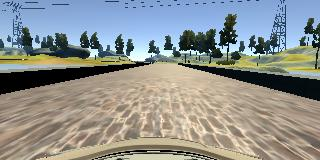
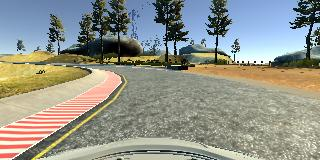
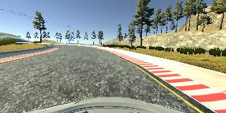

# **Behavioral Cloning** 

---

**Behavioral Cloning Project**

The goals / steps of this project are the following:
* Use the simulator to collect data of good driving behavior
* Build, a convolution neural network in Keras that predicts steering angles from images
* Train and validate the model with a training and validation set
* Test that the model successfully drives around track one without leaving the road
* Summarize the results with a written report


## Rubric Points
### Here I will consider the [rubric points](https://review.udacity.com/#!/rubrics/432/view) individually and describe how I addressed each point in my implementation.  

---
### Files Submitted & Code Quality

#### 1. Submission includes all required files and can be used to run the simulator in autonomous mode

My project includes the following files:
* model.py containing the script to create and train the model
* drive.py for driving the car in autonomous mode
* model.h5 containing a trained convolution neural network 
* writeup_report.md or writeup_report.pdf summarizing the results

#### 2. Submission includes functional code
Using the Udacity provided simulator and my drive.py file, the car can be driven autonomously around the track by executing 
```sh
python drive.py model.h5
```

#### 3. Submission code is usable and readable

The model.py file contains the code for training and saving the convolution neural network. The file shows the pipeline I used for training and validating the model, and it contains comments to explain how the code works.

### Model Architecture and Training Strategy

#### 1. An appropriate model architecture has been employed

My model consists of a convolution neural network comming from Nvedia Self-Driving car. Which have 3 5*5 filter size convolutional layer follow with 2 3*3 filter size convolutional layer, all convolutional filters moing with stride of 2. (model.py lines 54-67) 

The model includes RELU activation function after each convolutional layers to introduce nonlinearity and the data is normalized in the model using a Keras lambda layer (code line 55). 


#### 2. Model parameter tuning

The model used an Nadam optimizer, so the learning rate was not tuned manually (model.py line 69).

#### 3. Appropriate training data

Training data was chosen to keep the vehicle driving on the road. I used a combination of center lane driving, recovering from the left and right sides of the road, I drive multipal circles is different stytle to make sure that my var will not going out in different situation.

For details about how I created the training data, see the next section. 

### Model Architecture and Training Strategy

#### 1. Solution Design Approach

The overall strategy for deriving a model architecture was to ...

My first step was to use a convolution neural network model similar to the VGG16 I thought this model might be appropriate because I have used that simmilar structure in different projects. But I find this structure will overfit the model with low dropout rate and will perform bad with a high dropout rate.

Then I try a structure comes from Nvedia Self-Driving car. This structure have no dropout layers but also do not have a overfit issue.

The final step was to run the simulator to see how well the car was driving around track one. There were a few spots where the vehicle fell off the track.To improve the driving behavior in these cases, I tried to filp the picture when the car turing, and cut the unnecessary part of picture.

At the end of the process, the vehicle is able to drive autonomously with full speed of 30 around the track without leaving the road.

#### 2. Final Model Architecture

The final model architecture (model.py lines 54-67) consisted of a convolution neural network with the following layers and layer sizes.

    _________________________________________________________________
    Layer (type)                 Output Shape              Param #   
    =================================================================
    lambda_1 (Lambda)            (None, 160, 320, 3)       0         
    _________________________________________________________________
    cropping2d_1 (Cropping2D)    (None, 65, 320, 3)        0         
    _________________________________________________________________
    conv2d_1 (Conv2D)            (None, 33, 160, 24)       1824      
    _________________________________________________________________
    conv2d_2 (Conv2D)            (None, 17, 80, 36)        21636     
    _________________________________________________________________
    conv2d_3 (Conv2D)            (None, 9, 40, 48)         43248     
    _________________________________________________________________
    conv2d_4 (Conv2D)            (None, 5, 20, 64)         27712     
    _________________________________________________________________
    conv2d_5 (Conv2D)            (None, 3, 10, 64)         36928     
    _________________________________________________________________
    flatten_1 (Flatten)          (None, 1920)              0         
    _________________________________________________________________
    dense_1 (Dense)              (None, 100)               192000    
    _________________________________________________________________
    dense_2 (Dense)              (None, 50)                5000      
    _________________________________________________________________
    dense_3 (Dense)              (None, 10)                500       
    _________________________________________________________________
    dense_4 (Dense)              (None, 1)                 11        
    =================================================================
    Total params: 328,859
    Trainable params: 328,859
    Non-trainable params: 0
    _________________________________________________________________

#### 3. Creation of the Training Set & Training Process

To capture good driving behavior, I first recorded two laps on track one using center lane driving. Here is an example image of center lane driving:



I then recorded the vehicle recovering from the left side and right sides of the road back to center so that the vehicle would learn to .... These images show what a recovery looks like starting from ... :




Then I repeated this process on track two in order to get more data points.

To augment the data sat, I also flipped images and angles thinking that this would ... For example, here is an image that has then been flipped:


Etc ....

After the collection process, I had 8402 number of data points. I then centralized data by deviding 255 and minus 0.5.

I finally randomly shuffled the data set each epoch and put 20% of the data into a validation set. 

I used this training data for training the model. The validation set helped determine if the model was over or under fitting. The ideal number of epochs was 5 as evidenced by the sse decerase each epoch. I used an Nadam optimizer so that manually training the learning rate wasn't necessary.
